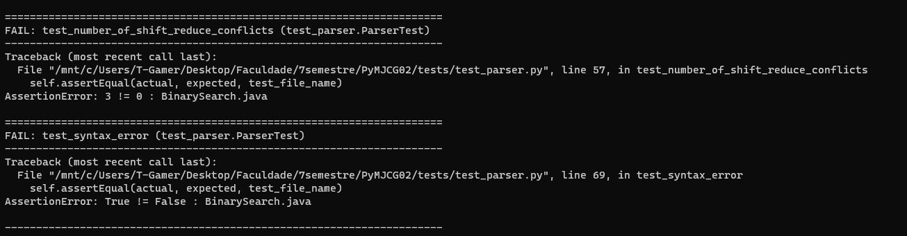

# 1º Relatóio: Etapa AI-a (Analisador Léxico e Sintático)

1. Qual é o nome do relator?

   > Laura Maria Alencar Leal Petrola

2. A etapa foi completamente ou parcialmente concluída?

   > A etapa foi parcialmente concluída.

3. No caso de parcialmente concluída, o que não foi concluído?

   > Tivemos um problema com a execução do **parser**, onde tivemos 3 conflitos de shift/reduce e leituras incorretas de certos programas (_BinarySearch.java_).

4. O programa passa nos testes automatizados?

   > Realizamos os testes e ocorreu falha em 4 casos. 
   Dois deles estão de acordo, porém os casos de testes está com a configuração errada, observe: 
   
   Nesse caso, a função fatorial possui um "-" que não foi contado e que conta como um token a mais para validação. Com isso, os valores estão corretos no teste.

5. Algum erro de execução foi encontrado para alguma das entradas? Quais?

   > Nos outros dois casos, tivemos 3 problemas de conflitos (shift/reduce) e uma validação incorreta de sintáxe, observe:
   

6. Quais as dificuldades encontradas para realização da etapa do projeto?

   > A implementação do Parser foi bem complicada, principalmente na resolução de conflitos e prioridades das instruções.

7. Qual a participação de cada membro da equipe na etapa de execução?

   > Gabriel Brilhante se envolveu principalmente com a implementação do lexer, Gabriel Passos e Laura Petrola atuaram em conjunto no Parser. Mas no fim, todos trabalharam juntos.

# 2º Relatóio: Etapa AI-b (Árvores Sintática Abstrata e Análise Semântica)

1. Qual é o nome do relator?

    > Escreva sua resposta aqui

2. A etapa foi completamente ou parcialmente concluída?

    > Escreva sua resposta aqui

3. No caso de parcialmente concluída, o que não foi concluído?

    > Escreva sua resposta aqui

4. O programa passa nos testes automatizados?
    
    > Escreva sua resposta aqui

5. Algum erro de execução foi encontrado para alguma das entradas? Quais?
    
    > Escreva sua resposta aqui

6. Quais as dificuldades encontradas para realização da etapa do projeto?
    
    > Entender as recursões à esquerda!!!! LEFTPARENT Expression RIGHTPARENT: Exp()?

7. Qual a participação de cada membro da equipe na etapa de execução?
    
    > Escreva sua resposta aqui

# 3º Relatóio: Etapa AI-c (Tradução para o Código Intermediário)

1. Qual é o nome do relator?

    > Escreva sua resposta aqui

2. A etapa foi completamente ou parcialmente concluída?

    > Escreva sua resposta aqui

3. No caso de parcialmente concluída, o que não foi concluído?

    > Escreva sua resposta aqui

4. O programa passa nos testes automatizados?
    
    > Escreva sua resposta aqui

5. Algum erro de execução foi encontrado para alguma das entradas? Quais?
    
    > Escreva sua resposta aqui

6. Quais as dificuldades encontradas para realização da etapa do projeto?
    
    > Escreva sua resposta aqui

7. Qual a participação de cada membro da equipe na etapa de execução?
    
    > Escreva sua resposta aqui

# 4º Relatóio: Etapa AI-d (Seleção de Instruções)

1. Qual é o nome do relator?

    > Escreva sua resposta aqui

2. A etapa foi completamente ou parcialmente concluída?

    > Escreva sua resposta aqui

3. No caso de parcialmente concluída, o que não foi concluído?

    > Escreva sua resposta aqui

4. O programa passa nos testes automatizados?
    
    > Escreva sua resposta aqui

5. Algum erro de execução foi encontrado para alguma das entradas? Quais?
    
    > Escreva sua resposta aqui

6. Quais as dificuldades encontradas para realização da etapa do projeto?
    
    > Escreva sua resposta aqui

7. Qual a participação de cada membro da equipe na etapa de execução?
    
    > Escreva sua resposta aqui

# 5º Relatóio: Etapa AI-e (Alocação de Registradores)

1. Qual é o nome do relator?

    > Escreva sua resposta aqui

2. A etapa foi completamente ou parcialmente concluída?

    > Escreva sua resposta aqui

3. No caso de parcialmente concluída, o que não foi concluído?

    > Escreva sua resposta aqui

4. O programa passa nos testes automatizados?
    
    > Escreva sua resposta aqui

5. Algum erro de execução foi encontrado para alguma das entradas? Quais?
    
    > Escreva sua resposta aqui

6. Quais as dificuldades encontradas para realização da etapa do projeto?
    
    > Escreva sua resposta aqui

7. Qual a participação de cada membro da equipe na etapa de execução?
    
    > Escreva sua resposta aqui

# 6º Relatóio: Etapa AI-f (Integração e Geração do Código Final)

1. Qual é o nome do relator?

    > Escreva sua resposta aqui

2. A etapa foi completamente ou parcialmente concluída?

    > Escreva sua resposta aqui

3. No caso de parcialmente concluída, o que não foi concluído?

    > Escreva sua resposta aqui

4. O programa passa nos testes automatizados?
    
    > Escreva sua resposta aqui

5. Algum erro de execução foi encontrado para alguma das entradas? Quais?
    
    > Escreva sua resposta aqui

6. Quais as dificuldades encontradas para realização da etapa do projeto?
    
    > Escreva sua resposta aqui

7. Qual a participação de cada membro da equipe na etapa de execução?
    
    > Escreva sua resposta aqui